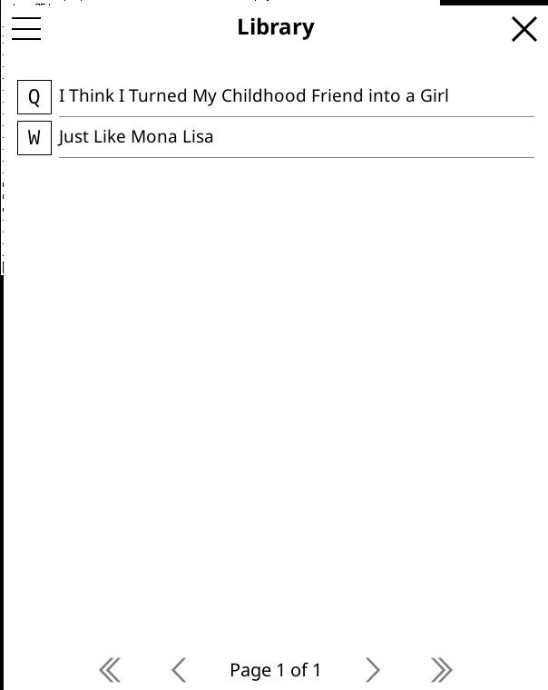
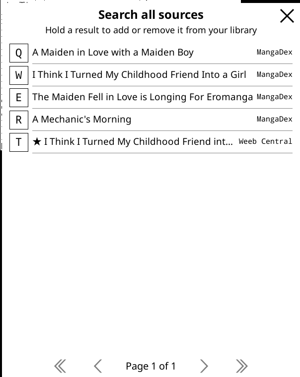
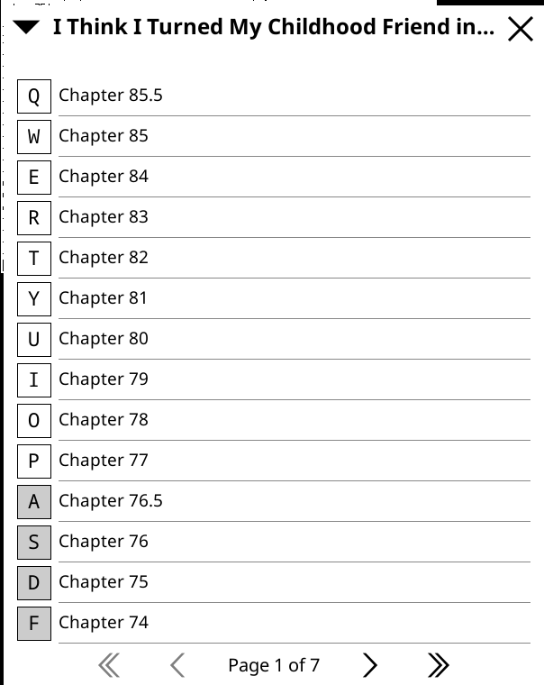
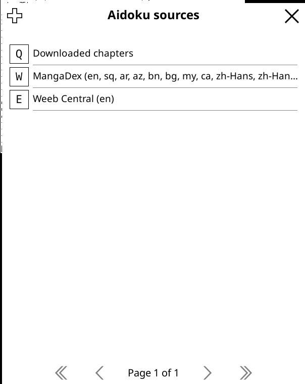
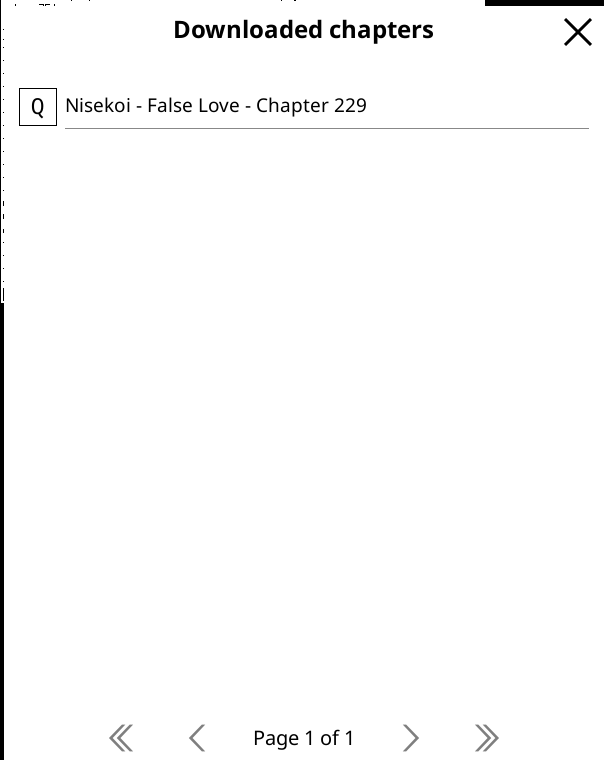
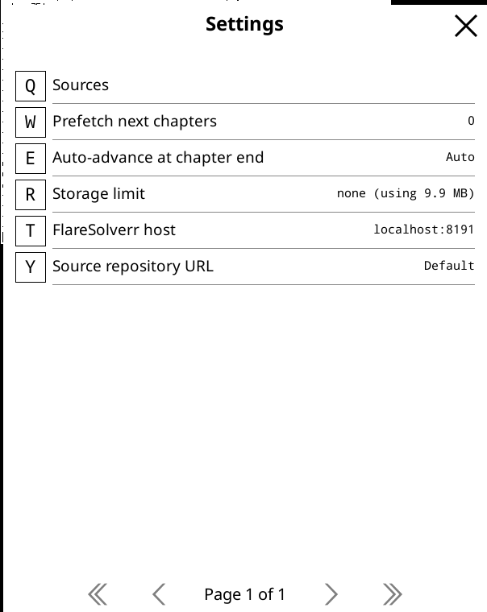

# aidoku-backend-go

A Go reimplementation of [AidokuRunner](https://github.com/Aidoku/AidokuRunner) —
the engine [Aidoku](https://aidoku.app) uses to run manga-source extensions
(`.aix` files: `main.wasm` + JS, executed via QuickJS). This lets any Go
program embed the same source ecosystem Aidoku uses on iOS, without a Swift
runtime.

This is an independent, unofficial project — not affiliated with or endorsed
by the Aidoku team. It's compatible with the Aidoku source format because
that's the ecosystem it reimplements the runtime for.

The primary consumer right now is a **KOReader plugin**: browse manga source
repositories compatible with the Aidoku source format, search and download
chapters as CBZ, and read them without leaving KOReader.

## KOReader plugin

<p>
  
  
  
</p>
<p>
  
  
  
</p>

- **Library** — track manga across sources, with unread/read chapter state.
- **Global search** — search every installed source at once and add results
  straight to your library.
- **Source browsing** — install sources from a repository (defaults to the
  official Aidoku source repository, configurable), then search and browse
  per-source.
- **Downloads** — queue chapters as CBZ files and read them offline; a
  built-in index tracks what's downloaded and where.
- **Settings** — prefetching, auto-advance at chapter end, storage limits,
  FlareSolverr host, and the source repository URL.

### Installing

1. Grab the plugin: copy [`koreader/aidoku.koplugin`](koreader/aidoku.koplugin)
   into KOReader's `plugins/` directory (e.g.
   `~/.config/koreader/plugins/` or `koreader/plugins/` depending on
   platform), or build it yourself (see below).
2. Restart KOReader. The plugin's entry appears under the search/tools menu
   (the 🔍 tab in the top menu bar).
3. Open it → the hamburger menu (☰) → **Settings → Sources → +** to browse
   the source repository and install a source, or **Search all sources** to
   search across everything you've already installed.

The plugin bundles a prebuilt `aidoku-run` binary for `arm` (armv7 Kindle/Kobo)
and `arm64` (aarch64 devices and desktop Linux) under `bin/`. If you're on a
different architecture, or want the latest code, build it yourself:

```sh
./koreader/build.sh
```

This cross-compiles `aidoku-run` for every supported target and drops it into
`aidoku.koplugin/bin/<arch>/`, ready to copy alongside the Lua files.

## Repository layout

This repo is both a Go library and the KOReader plugin's backend:

| Path | What it is |
| --- | --- |
| [`source/`](source) | Loads a `.aix` (or a plain directory) — manifest, WASM, filters/settings — and boots the QuickJS runtime for it. |
| [`runtime/`](runtime) | The QuickJS interpreter wrapper and host bindings (net, storage, defaults, webview, FlareSolverr, cookies) that sources call into. |
| [`models/`](models) | Mirrors of AidokuRunner's Swift models, with both binary (postcard) and JSON encode/decode. |
| [`downloads/`](downloads) | SQLite-backed index of downloaded chapters. `Open`/`Record` are the only methods `aidoku-run` still calls; the KOReader plugin reads/deletes from the same file directly. |
| [`settingsstore/`](settingsstore) | Flat JSON key/value store, namespaced per source. |
| [`repo/`](repo) | Fetches/parses a source-repository index and installs `.aix` files. |
| [`cbz/`](cbz) | Writes pages to a `.cbz` atomically. |
| [`cmd/aidoku-run`](cmd/aidoku-run) | CLI test harness: loads one source and runs a command against it (`search`, `download`, `manga`, `filters`, `settings`, ...). Not a daemon — every invocation loads the source fresh. |
| [`koreader/aidoku.koplugin`](koreader/aidoku.koplugin) | The KOReader plugin — Lua UI that shells out to `aidoku-run`, and talks directly to its own SQLite files (downloads index, library/history) via KOReader's bundled SQLite binding. |

### Building and testing the Go side

```sh
go build ./...
go vet ./...
go test ./...
```

### Using the CLI directly

`aidoku-run` takes a source directory (or `.aix`) as its first argument and a
command as its second:

```sh
go run ./cmd/aidoku-run <source-dir-or-.aix> manifest
go run ./cmd/aidoku-run <source-dir-or-.aix> search "one piece"
go run ./cmd/aidoku-run <source-dir-or-.aix> download <manga-id> <chapter-id> <out-dir>
```

See `aidoku-run`'s `-h`/no-args output for the full command set. The downloads
SQLite index it writes to (`<downloads-dir>/index.db`) is a plain SQLite file —
inspect it directly with `sqlite3 <downloads-dir>/index.db` if needed.

## Status

Actively developed alongside the KOReader plugin; expect rough edges. Issues
and PRs welcome.
